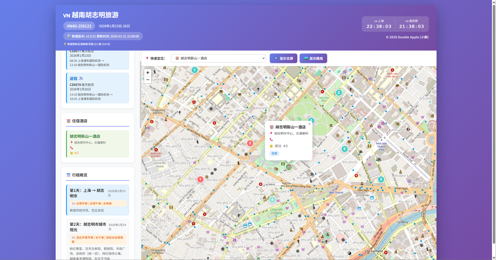

# 胡志明市4天旅游助手 🇻🇳

一个纯前端开发的旅游助手应用，用于展示胡志明市4天3晚旅游计划的地图视图。

## 🎯 项目阶段规划

### 第一阶段：功能验证期 ✅ 已完成

**目标**: 完成网站基础功能，确保所有地点和行程正确展示

**完成内容**:
- ✅ 交互式地图展示所有地点（酒店、景点、机场）
- ✅ 4天行程完整规划和路线可视化
- ✅ 快速定位功能（机场、酒店、景点）
- ✅ 地点详情弹窗显示
- ✅ 行程时间表展示
- ✅ 重要提示和紧急联系信息

**验证标准**:
- 所有地点标记在地图上正确显示
- 点击标记能显示正确的详细信息
- 4天行程路线清晰可见
- 快速定位功能正常工作

### 第二阶段：上线发布期 🚀 进行中

**目标**: 网站正式上线，提供游客互动功能

**计划功能**:
- 🌐 部署网站到公网访问
- ❤️ 景点点赞/收藏功能
- 📊 实时显示景点受欢迎程度
- 💾 持久化存储用户点赞数据
- 🎨 优化移动端体验

**技术实现**:
```
- 后端API开发（Node.js/Python）
- 数据库设计（用户点赞数据）
- 前后端对接
- CDN静态资源托管
```

**当前效果预览**:



### 第三阶段：增强扩展期 📋 规划中

**计划功能**:
- 👥 用户注册登录系统
- 📝 用户评论和评分功能
- 📸 用户照片分享
- 🗺️ 自定义路线规划
- 🌍 多语言支持（中文/英文/越南语）
- 📱 PWA移动应用支持

### 第四阶段：体验优化期 ✅ 已完成

**已完成功能**:
- ✅ 📱 优化Android移动端排版和显示效果
- ✅ 💱 添加越南盾(VND)与人民币(CNY)实时汇率换算功能
- ✅ 📊 添加浏览量和点赞统计功能
- ✅ 🗺️ 实现离线地图功能（因地图服务器在海外，离线地图可提升国内访问速度）

**使用说明**:
- 📘 离线地图详细使用指南：[OFFLINE_MAP_GUIDE.md](OFFLINE_MAP_GUIDE.md)
- 🧪 离线地图测试页面：打开 `docs/offline_test.html` 进行测试
- 📥 下载离线地图：运行 `python download_tiles.py`（可选）

**待实现功能**:
- 🌤️ 增加上海与胡志明市实时天气对比展示（规划中）

---

## ✨ 功能特点

- 📍 **交互式地图** - 显示所有酒店和景点的精确位置
- 🎯 **景点详情** - 点击标记查看详细介绍、开放时间和亮点
- 📅 **行程管理** - 按天查看行程安排，点击可定位到当天的景点
- 🛤️ **路线规划** - 可视化显示每天的游览路线
- ⚠️ **重要提示** - 旅游注意事项和实用信息
- 📊 **数据追踪** - 实时显示数据版本，更新后自动提醒刷新

## 🚀 快速开始

### 打开应用

直接双击 `src/index.html` 文件即可在浏览器中打开！

### 项目结构

```
Vietnam_tour/
├── data/
│   └── data.js          # 所有旅游数据（酒店、景点、行程等）
├── src/
│   ├── index.html       # 主页面
│   ├── app.js           # 应用逻辑
│   └── style.css        # 样式文件
├── docs/                # 文档目录
├── tests/               # 测试文件
└── DATA_UPDATE_GUIDE.md # 数据更新指南
```

## 📊 数据更新

### ⚠️ 重要：数据更新流程

1. **更新数据** - 编辑 `data/data.js` 文件
2. **修改版本号** - 更新 `DATA_VERSION` 和 `DATA_LAST_UPDATED`
3. **刷新页面** - 在浏览器中按 F5 或 Ctrl+R

**详细说明**: 请查看 [DATA_UPDATE_GUIDE.md](DATA_UPDATE_GUIDE.md)

### 数据文件位置

```
data/data.js
```

包含的数据：
- ✈️ 航班信息
- 🏨 酒店信息（3家）
- 🎯 景点信息（10个）
- 📅 行程安排（4天详细时间表）
- ⚠️ 重要提示（10条）
- 📞 紧急联系方式

## 🎨 功能展示

### 侧边栏面板

1. **航班信息** ✈️ - 自动提取并显示去程/返程航班
2. **住宿酒店** 🏨 - 显示所有酒店详情
3. **行程概览** 📅 - 4天行程快速浏览
4. **详细时间表** 🕘 - 可展开的详细行程时间表
5. **重要提示** ⚠️ - 旅游注意事项
6. **紧急联系** 📞 - 紧急电话号码

### 地图功能

- 📍 点击标记查看详细信息
- 🎯 不同颜色区分不同天的景点
- 🛤️ 显示/隐藏游览路线
- 🔍 显示全部或聚焦某一天

## 🛠️ 技术栈

- **HTML5** - 页面结构
- **CSS3** - 样式和响应式设计
- **JavaScript (ES6+)** - 应用逻辑
- **Leaflet.js** - 开源地图库
- **OpenStreetMap** - 免费地图数据

## 📱 浏览器兼容性

支持所有现代浏览器：
- ✅ Chrome/Edge（推荐）
- ✅ Firefox
- ✅ Safari

需要互联网连接以加载地图数据。

## 🔄 数据版本追踪

页面顶部会显示当前数据版本：

```
📊 数据版本: v1.0.0 | 更新时间: 2026-01-21 21:30:00
💡 数据更新后请刷新页面 (F5 或 Ctrl+R)
```

### 更新数据后

当您修改 `data/data.js` 后：

1. 修改版本号（例如 1.0.0 → 1.0.1）
2. 更新时间戳
3. 刷新浏览器（F5）
4. 召唤 Claude 帮忙检查

## 📖 使用文档

- [数据更新指南](DATA_UPDATE_GUIDE.md) - 如何更新旅游数据
- [CLAUDE.md](CLAUDE.md) - 代码架构说明（供 Claude 参考）

## 💡 常见问题

**Q: 数据更新后页面没变化？**
A: 按 F5 或 Ctrl+R 刷新页面

**Q: 如何添加新景点？**
A: 在 `data/data.js` 的 `tourData.attractions` 数组中添加

**Q: 如何修改航班信息？**
A: 在 `data/data.js` 的 `tourData.itinerary` 中修改

**Q: 地图不显示？**
A: 检查网络连接，地图需要从互联网加载

## 🎯 旅行信息

- **团号**: VN4D-250123
- **日期**: 2026年1月23日-26日
- **目的地**: 越南胡志明市

## 📝 许可证

MIT License

---

**祝您旅途愉快！** 🎒✈️

---

## 🤖 召唤 Claude

当您需要帮助时，可以说：

- "数据已更新，请帮我检查"
- "我更新了 data.js，请帮我刷新页面"
- "请检查一下数据是否正确"
- "帮我添加一个新的景点"
